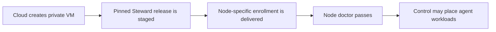

# Deploy Steward node pools in the cloud

Steward can use the cloud's existing VM fleet service while keeping agent
placement and authority inside Steward. You provide an approved machine image and
private network. One Terraform module call creates a repeatable node pool with an
exact Steward release.

This is the supported path when you want tens or hundreds of Linux agent hosts but
do not want Kubernetes to become a required part of the Steward trust boundary.

## What the modules do

| Cloud | Steward module | Cloud service it creates | Safe update behavior |
| --- | --- | --- | --- |
| AWS | `aws-steward-node-pool` | EC2 Auto Scaling Group | Versioned launch template and rolling instance refresh with rollback |
| Google Cloud | `gcp-steward-node-pool` | Regional Managed Instance Group | Proactive replacement with one surge VM and zero planned unavailability |
| Azure | `azure-steward-node-pool` | Linux Virtual Machine Scale Set | Manual instance batches until a complete Steward health signal is qualified |

All three modules:

- create private nodes without public IP addresses;
- require encrypted boot storage backed by your customer-managed key;
- enable the cloud's boot and metadata hardening where available;
- render the same provider-neutral, checksum-pinned cloud-init;
- stage one exact Steward release without placing credentials in Terraform;
- spread nodes across failure domains; and
- report a non-secret bootstrap digest for audit and rollout correlation.

They consume an existing network, machine image, and encryption key. They do not
create an enterprise network, identity hierarchy, image factory, controller, or
secret store on your behalf. Those resources usually have organization-specific
security and compliance requirements.

## Understand the two readiness gates

Cloud VM health and Steward readiness answer different questions:



The first gate is `/var/lib/steward-bootstrap/complete`. It proves that first boot
installed the requested release. It does not prove that the VM belongs to your site.

The second gate is:

```console
sudo /usr/local/libexec/steward/node-doctor --json
```

It passes only after node-specific enrollment and validates the installed runtime,
Docker, gVisor, systemd services, local health and readiness, Gateway, durable
stores, and filesystem capacity. Control also excludes a node until its enrolled
uplink reports usable capacity.

Keeping these gates separate prevents a staged but unauthorized VM from becoming
agent capacity merely because the cloud says its kernel is running.

## Before you begin

Prepare these existing resources:

1. A private subnet in at least two availability zones or failure domains.
2. Network policy with no public ingress and only the egress required for your
   release mirror, Steward Control, inference relay, and approved connectors.
3. A customer-managed disk-encryption key.
4. A Linux image with systemd, cloud-init, Docker, gVisor, curl, `timeout`, and
   `sha256sum`. Pin and scan the image like any other production artifact.
5. An exact Steward release tag plus independently obtained SHA-256 values for the
   installer, package, and checksum manifest.

For a disconnected or tightly filtered site, mirror the release files internally.
The module accepts credential-free mirror URLs and independent hashes and never
falls back to the public release when a mirror is configured.

## AWS

```hcl
module "steward_nodes" {
  source = "./steward/integrations/terraform/modules/aws-steward-node-pool"

  name               = "agents-prod"
  ami_id             = var.approved_steward_ami
  subnet_ids         = var.private_subnet_ids
  security_group_ids = [aws_security_group.steward_nodes.id]
  kms_key_arn        = aws_kms_key.steward_nodes.arn

  capacity = { min = 2, desired = 2, max = 20 }

  release_version  = var.steward_release
  installer_url    = var.steward_installer_url
  installer_sha256 = var.steward_installer_sha256
  release_mirror   = var.steward_release_mirror
}
```

The module requires Instance Metadata Service v2, limits metadata forwarding to
one hop, disables metadata tags, encrypts the root disk, and rolls launch-template
changes through EC2 Auto Scaling instance refresh. AWS documents the underlying
[launch-template](https://docs.aws.amazon.com/autoscaling/ec2/userguide/launch-templates.html)
and [Auto Scaling lifecycle](https://docs.aws.amazon.com/autoscaling/ec2/userguide/what-is-amazon-ec2-auto-scaling.html).

## Google Cloud

```hcl
module "steward_nodes" {
  source = "./steward/integrations/terraform/modules/gcp-steward-node-pool"

  name                  = "agents-prod"
  project_id            = var.project_id
  region                = var.region
  subnetwork_self_link  = google_compute_subnetwork.private.self_link
  source_image          = var.approved_steward_image
  service_account_email = google_service_account.steward_nodes.email
  kms_key_self_link     = google_kms_crypto_key.steward_nodes.id

  capacity = 2

  release_version  = var.steward_release
  installer_url    = var.steward_installer_url
  installer_sha256 = var.steward_installer_sha256
  release_mirror   = var.steward_release_mirror
}
```

The module blocks project SSH keys, enables OS Login and Shielded VM controls, and
uses no external IP. The supplied service account receives no role and no OAuth
scope from this module. Google documents regional groups and their
[controlled rolling updates](https://cloud.google.com/compute/docs/instance-groups/rolling-out-updates-to-managed-instance-groups).

## Azure

```hcl
module "steward_nodes" {
  source = "./steward/integrations/terraform/modules/azure-steward-node-pool"

  name                      = "agents-prod"
  resource_group_name       = azurerm_resource_group.site.name
  location                  = azurerm_resource_group.site.location
  subnet_id                 = azurerm_subnet.private.id
  network_security_group_id = azurerm_network_security_group.steward_nodes.id
  source_image_id           = var.approved_steward_image_id
  disk_encryption_set_id    = azurerm_disk_encryption_set.steward_nodes.id
  admin_ssh_public_key      = var.break_glass_ssh_public_key

  capacity = 2

  release_version  = var.steward_release
  installer_url    = var.steward_installer_url
  installer_sha256 = var.steward_installer_sha256
  release_mirror   = var.steward_release_mirror
}
```

The module disables password login, enables host encryption, Secure Boot and vTPM,
and grants no Azure role to its system-assigned identity. Updates remain manual
because Azure's safe rolling repair requires an Application Health signal. A raw
VM probe does not cover Steward's authenticated Executor readiness. Azure explains
that requirement in its [rolling upgrade guidance](https://learn.microsoft.com/azure/virtual-machine-scale-sets/virtual-machine-scale-sets-configure-rolling-upgrades).

## Enroll new nodes

First boot intentionally creates no site authority. For each VM, prepare a
short-lived, node-specific package from a trusted operator machine:

```console
stewardctl site node prepare steward-site NODE_ID
```

Transfer that package through your approved temporary channel, then activate it on
the destination:

```console
sudo stewardctl site node activate steward-node-NODE_ID
sudo /usr/local/libexec/steward/node-doctor --json
```

Remove the transferred package after successful activation. Do not place it in a
Terraform variable, state backend, cloud-init document, VM tag, scale-set model,
or machine image. The package contains a short-lived enrollment bearer even though
it does not contain tenant signing keys.

This finite ceremony supports fixed and deliberately expanded pools. Secure
zero-touch elastic enrollment is not shipped yet. The planned profile uses
SPIFFE/SPIRE to bind a short-lived certificate to the cloud instance identity and
then issues node-specific Steward authority. A shared “join token” would be easier
to demonstrate but would let any reader of deployment metadata mint fleet nodes,
so Steward does not offer that shortcut.

## Scale safely

### Scale out

1. Increase desired capacity.
2. Wait for the staging marker on each new VM.
3. Enroll each new node.
4. Require the node doctor to pass and confirm that Control sees fresh capacity.

Until step 4, the new VM costs money but cannot receive Steward placements.

### Scale in

Do not let a generic CPU rule terminate an arbitrary active node. For each selected
node:

1. cordon it so the scheduler stops placing new work;
2. drain it within the declared disruption budget;
3. confirm that durable or irreplaceable state has an approved disposition;
4. let the cloud pool terminate that VM; and
5. verify the node becomes stale or retired in Control without a late generation
   regaining authority.

Keep AWS `capacity.min`, the Google target size, or the Azure instance count fixed
until this termination workflow is automated in your environment. The modules do
not create a cloud-specific function with broad Steward administrator authority.

## Controller availability

The bundled Steward controller is a bounded, single-writer service. Keep its state
on encrypted persistent storage, back it up, test restoration, and run exactly one
active writer. A large node pool does not make the controller highly available.
See the [control-plane guide]({{ '/guides/control-plane/' | relative_url }}) and the
[control-plane boundary]({{ '/concepts/control-plane-boundary/' | relative_url }}).

## Security boundary

These modules reduce configuration drift; they do not remove the cloud from the
trust boundary. A cloud account administrator, host administrator, or hypervisor
operator may be able to inspect node memory or alter the host. Docker and gVisor
isolate untrusted agent containers from one another but do not prove the cloud host
is honest. Confidential VMs and measured boot need a separately tested remote
attestation design before Steward can make a stronger claim.
